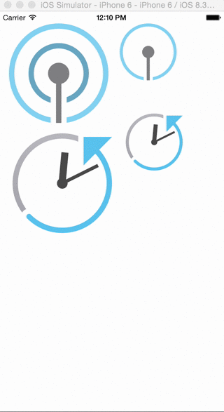

# APaintCodeWorkFlow

## A typical workflow with PaintCode.

### Or: _How to convert SVG-Images to (ObjC-)Code and animate them_.

Shown at [CocoaheadsFFM on 1st of June 2015](http://cocoaheadsffm.github.io/cocoaheadsffm/) by [Carl Jahn](https://twitter.com/tinycarl) and [Florian Bachmann](https://twitter.com/florianbachmann).

If you don't know what [PaintCode](http://www.paintcodeapp.com) is, or how to use it head over to their excellent [tutorials](http://www.paintcodeapp.com/tutorials).

In this "Demo"-project (maybe tutorial) we are showing the workflow from two SVG-images we got from our designer

to animated images in our iOS-App.

